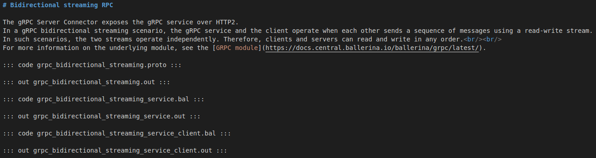

This document is a guide to add a BBE and write its content using markdown syntax.

## 1. Select the branch to send the BBE update

The BBE sources can be found in the `<ballerina-distribution-repo>/examples/` directory>. You can select the branch to update the BBEs as follows.

- `master` branch - BBE updates that should immediately be reflected in the live site
- respective update release branch (e.g., `release-2201.2.0`) - BBE updates of the next update release
- `2201.0.x` branch - BBE updates of the next patch release

## 2. Create the directory structure of a BBE

Below is the directory structure of a BBE directory (in the `ballerina-distribution` repo) in a `tree format`.

> /examples
>
> |--- bbe-url
>
> |&nbsp;&nbsp;&nbsp;&nbsp;|--- bal_file(s)
>
> |&nbsp;&nbsp;&nbsp;&nbsp;|--- out_file(s)
>
> |&nbsp;&nbsp;&nbsp;&nbsp;|--- metatags_file
>
> |&nbsp;&nbsp;&nbsp;&nbsp;|--- **md_file**

## 3. Create the markdown file

- In the BBE folder (`./examples/<bbe-url>`), if a markdown file doesn’t exist, create a new markdown file with the name of the BBE.

> E.g., `hello_world.md`

### 3.1. Write the BBE body content

- The content written in the markdown file will be rendered in the body of the BBE page. The page content will be created in the order the content is written in the markdown file.

- The content can include any markdown syntax. In the converting process, they will be converted into corresponding HTML tags.

- Apart from the basic markdown syntax, there are **2** special syntax for `ballerina code snippets` and `ballerina outputs` of a BBE.

<table>
    <tr>
        <th>Component</th>
        <th>Syntax</th>
    </tr>
    <tr>
        <td>Ballerina Code</td>
        <td><i>::: code &lt;resource_file_name&gt; :::</i></td>
    </tr>
    <tr>
        <td>Output</td>
        <td><i>::: out &lt;resource_file_name&gt; :::</i></td>
    </tr>
</table>

> E.g.,
>
> 1.  **_::: code hello_world.bal :::_**
> 2.  **_::: out hello_world.out :::_**

### 3.2 Sample markdown file content

## Generate the HTML BBE pages from the markdown files

The `markdownConverter.js` script located at `<ballerina-dev-website-repo>/.github/scripts/bbe` is used to generate the HTML BBE pages using the markdown files.

For more details about the markdown converter script, see [document](https://github.com/Ballerina-By-Examples/ballerina-dev-website/blob/bbe-generation-v2/.github/scripts/bbe/README.md).
